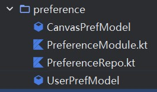
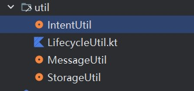
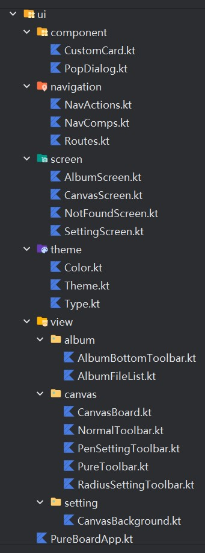

# PureBoard

## 设计文档

### 整体架构


框架采用kotlin+compose声明式语法编写
1. data 指定数据库dao操作，包括借助sharepreference库来对用户配置进行存储
2. domain 定义数据库操作实体与接口，由data层进行对应方法的实现
3. ui 前端界面绘制
4. util 一些常用小工具，如toast弹出气泡提示框

<br>

### Domain层

在此层次定义数据结构

PenConfig为画笔参数实体类，如记录当前笔刷路径、笔刷尺寸大小、笔刷颜色、笔刷模式（绘画和橡皮）
```kotlin
class PenConfig(
  var path: Path = Path(),
  var strokeWidth: Float = 10f,
  var color: Color = Color.Blue,
  var penMode: PenMode = PenMode.Pen
) {
  ...
}
```

DrawMode内定义了多个枚举类，用于限定笔刷类型等；
```kotlin
// 定义两种绘画模式
enum class DrawMode {
  PURE, NORMAL
}

enum class PenMode {
  Pen, Eraser, None
}
enum class MotionEvent {
  Idle, Down, Move, Up
}
```

<br>

### data

#### viewmodel

由于此项目是基于mvvm架构搭设，故viewmodel实现实体类与视图对象之间的信息交互与存储功能；  
利用compose提供的remember实现stateful状态记忆功能  
搭配hilt的依赖注入机制，实现能从任意一个前端界面都能直接从容器内调用其唯一实例  

参考CanvasViewModel.kt对应代码主要实现以下功能
- 状态管理
- 参数初始化以及对接sharepreference，提取保存好的用户数据
- 统一更新方法
- 导出png图像至download文件夹方法

```kotlin
@HiltViewModel
class CanvasViewModel @Inject constructor(
  private val preferenceRepo: PreferenceRepo
) : ViewModel() {
    // 关键stateful参数
  var paths = mutableStateListOf<PenConfig>()
  var pathsUndone = mutableStateListOf<PenConfig>()
  var motionEvent by mutableStateOf(MotionEvent.Idle)
  var currentPath by mutableStateOf(PenConfig())
  var currentPosition by mutableStateOf(Offset.Unspecified)

  val state = CanvasState()

  // 初始化
  init {
    initData()
  }

  private fun initData() = viewModelScope.launch {
    val result = preferenceRepo.getCanvasSetting()
    if (result.isSuccess) {
      result.getOrNull()?.apply {
        state.autoReverseColor = autoReverseColor
        state.rememberAll = rememberAllSettings

        if (rememberAllSettings) {
          currentPath.strokeWidth = strokeWidth
//          currentPath.color = Color(penColor)
        }
      }
    }
  }

  fun updateState(fn: CanvasState.() -> Unit) = viewModelScope.launch {
    state.fn()
  }

  fun savePref() = viewModelScope.launch {
    val canvasPrefModel = CanvasPrefModel(
      autoReverseColor = state.autoReverseColor,
      rememberAllSettings = state.rememberAll,
      strokeWidth = currentPath.strokeWidth,
//      penColor = currentPath.color.value.toLong()
    )
    preferenceRepo.saveCanvasSetting(canvasPrefModel)
  }
  ...
}
```

<br>

#### state

除此之外，viewmodel还需要额外定义一个state来进行统一的状态管理  
以下代码展示了与CanvasViewModel对接的对应state参数定义  
其对应的参数即表示了app对应的功能（CanvasViewModel主管绘画方面属性，另有一个LayoutViewModel管理全局视图与app基本设置方面属性）

```kotlin
class CanvasState {
  /*画图参数*/
  var scale by mutableFloatStateOf(1f)
  var translation by mutableStateOf(Offset(0f, 0f))
  var pivot by mutableStateOf(Offset(0f, 0f))
  var size: Size? = null

  /*工具栏参数*/
  var currentMode: DrawMode by mutableStateOf(DrawMode.NORMAL) // 绘画模式
  var currentPenMode: PenMode by mutableStateOf(PenMode.Pen)   // 画笔模式
  var showOptions: Boolean by mutableStateOf(true)        // 纯净模式是否展示
  var currentSelected: Int by mutableIntStateOf(-1)            // 当前选择的工具栏下标

  /*绘画工具栏参数*/
  var toggleDeepMode: Boolean by mutableStateOf(false)     // 是否进入深度修改颜色模式
  var autoReverseColor: Boolean by mutableStateOf(false)    // 自动翻转笔画颜色

  /*全局参数*/
  var rememberAll: Boolean by mutableStateOf(false)       // 关闭app前自动保存所有画板状态
}
```

<br>

#### preference



由于此部分代码较多，只讲述对应思路
1. CanvasPrefModel 定义存储笔刷相关参数实体类
2. UserPrefModel 定义存储用户界面定义相关参数实体类
3. PreferenceRepo 传入对应实体类，统一管理参数CRUD接口方法
4. PreferenceModule 抽象方法，使用hilt进行依赖注入，利用全局容器管理

<br>

### util



定义诸多相关的工具类  
如MessageUtil就把android内置的toast弹窗封装，方便后续代码调用

```kotlin
object MessageUtil {
  @Composable
  fun Toast(title: String) {
    val ctx = LocalContext.current
    LaunchedEffect(Unit) {
      Toast.makeText(ctx, title, Toast.LENGTH_SHORT).show()
    }
  }
}
```

<br>

### ui

> ui层绘制前端界面，并对接data层进行数据调用，完整实现MVVM架构的数据流闭环



<br>

#### component

定义可复用的组件逻辑，参考react设计思想，通常我们会把需要重复使用的组件，如card卡片、dialog对话框等封装为jsx，后续其他页面就可以直接调用此组件；  
相应的处理逻辑已经封装于该组件内；  

参考下方PopDialog代码，此弹窗将会被后续应用于图像保存、设置保存提示  
```kotlin
@OptIn(ExperimentalMaterial3Api::class)
@Composable
fun PopDialog(
  title: String = "注意",
  content: String = "确认执行此操作吗？",
  onAccepted: () -> Unit = {},
  onCancelled: () -> Unit = {},
) {
  AlertDialog(
    onDismissRequest = onCancelled,
    title = { Text(text = title) },
    text = { Text(text = content) },
    confirmButton = {
      TextButton(onClick = {
        onAccepted()
      }) {
        Text(text = "确认")
      }
    },
    dismissButton = {
      TextButton(onClick = onCancelled) {
        Text(text = "取消")
      }
    },
  )
}
```

<br>

#### navigation

navigation处理页面跳转逻辑  
1. routes 定义路由，包括侧边栏图标以及路由路径
2. navcomps 这里使用material-design提供的rail布局，实现左侧边栏导航功能
3. navactions 处理路由切换时的路由栈记忆以及拦截操作

参考NavActions代码
```kotlin
class NavActions(
  private val navController: NavHostController,
) {
  fun navTo(destination: RouterDestination) {
    navController.navigate(destination.route) {
      popUpTo(navController.graph.findStartDestination().id) {
        saveState = true
      }
      launchSingleTop = true
      restoreState = true
    }
  }
}

// 获取回退底部的路由信息
fun GetBottomNav(navBackStackEntry: NavBackStackEntry?) {
  val value = navBackStackEntry?.arguments
  Log.d(TAG, "getBottomNav: $value")
}
```

<br>

#### screen

前端界面定义  
根据设计需求，定义两个页面，一个是画板CanvasScreen，一个是设置SettingScreen  
其余的为辅助界面 

<br>

#### theme 

主题文件

<br>

#### view

之前定义的screen为整个视图  
此处的view则是对视图内容的填充细化  

<br>

#### 入口点

ui层提供一个入口点  
在此处实现viewmodel注入以及对应生命周期拦截；  
配置navigation路由导航；  

```kotlin
@Composable
fun PureBoardApp() {
  val layoutVM = hiltViewModel<LayoutViewModel>()
  val canvasVM = hiltViewModel<CanvasViewModel>()

  /*首次初始化时才会对颜色执行自动翻转，后续将关闭此功能*/
  val isDark = isSystemInDarkTheme()
  if (canvasVM.state.autoReverseColor and layoutVM.firstStart) {
    layoutVM.firstStart = !layoutVM.firstStart
    if (isDark) canvasVM.currentPath.color = Color.White
    else canvasVM.currentPath.color = Color.Black
  }

  ComposableLifecycle { _, event ->
    when (event) {
      Lifecycle.Event.ON_CREATE -> {
        Log.d(TAG, "onCreate")
      }

      Lifecycle.Event.ON_STOP -> {
        Log.d(TAG, "On Stop")
        // 仅当用户允许保存笔画信息时，才允许程序进入后台自动存储
        // 只要app进入后台则必定触发此生命周期回调，所以都能保证在用户关闭app前存储笔画数据
        // 强制后台杀死app的情况除外
        if (canvasVM.state.rememberAll) {
          canvasVM.savePref()
        }
      }

      else -> {}
    }
  }

  PureLayoutWrapper(layoutVM, canvasVM)
}

@Composable
private fun PureLayoutWrapper(layoutVM: LayoutViewModel, canvasVM: CanvasViewModel) {
  val scope = rememberCoroutineScope()

  val navController = rememberNavController()
  val navActions = remember(navController) {
    NavActions(navController)
  }
  val navBackStackEntry by navController.currentBackStackEntryAsState()
  val selectedDestination =
    navBackStackEntry?.destination?.route ?: Routes.CANVAS

  Row(
    modifier = Modifier.fillMaxSize()
  ) {
    AnimatedVisibility(visible = layoutVM.state.showNavRail) {
      NavRailComp(
        layoutVM = layoutVM,
        selectedDestination = selectedDestination,
        navToDestination = navActions::navTo,
      )
    }
    Box(
      Modifier.fillMaxSize()
    ) {
      NavHostComp(
        navActions = navActions,
        navController = navController,
        layoutVM = layoutVM,
        canvasVM = canvasVM
      )
    }
  }
}
```


